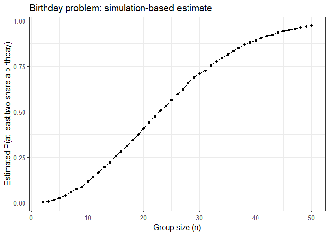
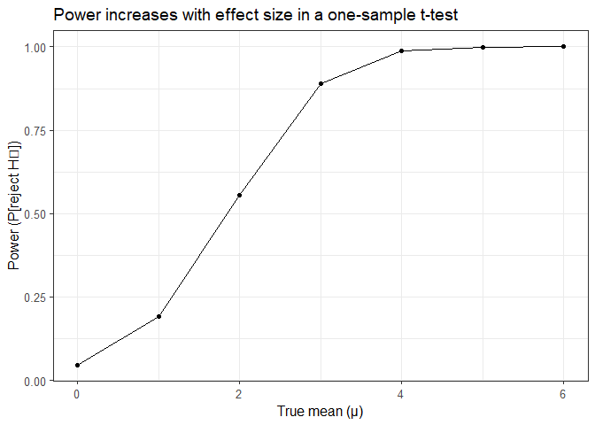
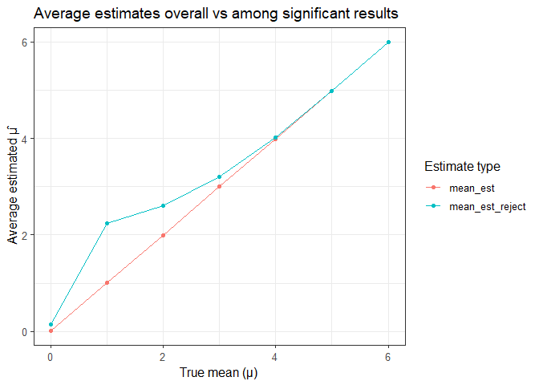
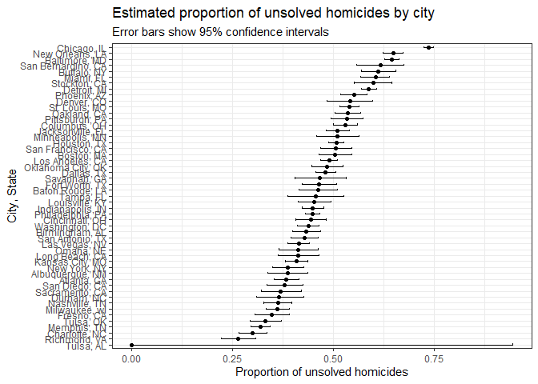

P8105 Homework 5
================
Daniel Jiao (dj2764)

# Load Library

``` r
library(tidyverse)
library(broom)
```

# Problem 1

## Function: does this group (size n) have a shared birthday

``` r
birthday_sim = function(n) {
  # Draw n birthdays from 365 days, with replacement
  bdays = sample(1:365, size = n, replace = TRUE)
  
  # TRUE = duplicated, FALSE otherwise
  any(duplicated(bdays))
}
```

## Run this function 10000 times

``` r
set.seed(123)  

sim_results = 
  map_df(2:50, function(n) {
    tibble(
      n = n,
      dup = replicate(10000, birthday_sim(n))
    )
  })

prob_df = 
  sim_results |>
  group_by(n) |>
  summarize(prob_shared_bday = mean(dup))
```

## Make plot.

``` r
prob_df |>
  ggplot(aes(x = n, y = prob_shared_bday)) +
  geom_line() +
  geom_point() +
  labs(
    x = "Group size (n)",
    y = "Estimated P(at least two share a birthday)",
    title = "Birthday problem: simulation-based estimate"
  ) +
  theme_bw(base_size = 12)
```

<!-- -->

# Problem 2

## Function to simulate one dataset and return estimate + p-value

``` r
# Parameters
n = 30
sigma = 5
mu_values = 0:6
n_sim = 5000

set.seed(123)

# Function
sim_one = function(mu) {
  x = rnorm(n, mean = mu, sd = sigma)
  t_out = t.test(x, mu = 0)
  tidy(t_out)[, c("estimate", "p.value")]
}

# Simulations
sim_results = 
  expand_grid(mu = mu_values, iter = 1:n_sim) |>
  mutate(test_res = map(mu, sim_one)) |>
  unnest(test_res)
```

## Make a plot showing the power of the test

``` r
power_df = 
  sim_results |>
  group_by(mu) |>
  summarize(power = mean(p.value < 0.05))

power_df |>
  ggplot(aes(x = mu, y = power)) +
  geom_line() +
  geom_point() +
  labs(
    x = "True mean (μ)",
    y = "Power (P[reject H₀])",
    title = "Power increases with effect size in a one-sample t-test"
  ) +
  theme_bw(base_size = 12)
```

<!-- -->

## Make First Plot

``` r
mu_est_df =
  sim_results |>
  group_by(mu) |>
  summarize(
    mean_est = mean(estimate),                       # overall mean estimate
    mean_est_reject = mean(estimate[p.value < 0.05]) # only for rejected tests
  )
```

## Make Second plot

``` r
mu_est_df |>
  pivot_longer(cols = c(mean_est, mean_est_reject),
               names_to = "type", values_to = "estimate") |>
  ggplot(aes(x = mu, y = estimate, color = type)) +
  geom_line() +
  geom_point() +
  labs(
    x = "True mean (μ)",
    y = "Average estimated μ̂",
    color = "Estimate type",
    title = "Average estimates overall vs among significant results"
  ) +
  theme_bw(base_size = 12)
```

<!-- -->

## Interpretation

The overall mean of μ̂ across all simulations is approximately equal to
the true μ (unbiased estimator).

The conditional mean (only when p \< 0.05) is higher than the true μ,
especially for small effect sizes.

This happens because when the true effect is small, only unusually large
positive sample means lead to rejection of the null — introducing
selection bias.

In other words: among significant results, the estimated effect size
tends to be inflated compared with the true value (the “winner’s
curse”).

# Problem 3

## Load & Check datasets

``` r
homicide_df = 
  read_csv("data/homicide-data.csv")
```

    ## Rows: 52179 Columns: 12
    ## ── Column specification ────────────────────────────────────────────────────────
    ## Delimiter: ","
    ## chr (9): uid, victim_last, victim_first, victim_race, victim_age, victim_sex...
    ## dbl (3): reported_date, lat, lon
    ## 
    ## ℹ Use `spec()` to retrieve the full column specification for this data.
    ## ℹ Specify the column types or set `show_col_types = FALSE` to quiet this message.

``` r
homicide_df |> glimpse()
```

    ## Rows: 52,179
    ## Columns: 12
    ## $ uid           <chr> "Alb-000001", "Alb-000002", "Alb-000003", "Alb-000004", …
    ## $ reported_date <dbl> 20100504, 20100216, 20100601, 20100101, 20100102, 201001…
    ## $ victim_last   <chr> "GARCIA", "MONTOYA", "SATTERFIELD", "MENDIOLA", "MULA", …
    ## $ victim_first  <chr> "JUAN", "CAMERON", "VIVIANA", "CARLOS", "VIVIAN", "GERAL…
    ## $ victim_race   <chr> "Hispanic", "Hispanic", "White", "Hispanic", "White", "W…
    ## $ victim_age    <chr> "78", "17", "15", "32", "72", "91", "52", "52", "56", "4…
    ## $ victim_sex    <chr> "Male", "Male", "Female", "Male", "Female", "Female", "M…
    ## $ city          <chr> "Albuquerque", "Albuquerque", "Albuquerque", "Albuquerqu…
    ## $ state         <chr> "NM", "NM", "NM", "NM", "NM", "NM", "NM", "NM", "NM", "N…
    ## $ lat           <dbl> 35.09579, 35.05681, 35.08609, 35.07849, 35.13036, 35.151…
    ## $ lon           <dbl> -106.5386, -106.7153, -106.6956, -106.5561, -106.5810, -…
    ## $ disposition   <chr> "Closed without arrest", "Closed by arrest", "Closed wit…

## Describe the raw data

The homicide dataset from The Washington Post contains information on
52,179 homicide cases across 50 large U.S. cities. Each row corresponds
to one individual homicide, and there are 12 variables in total.

Key variables include:

uid – a unique identifier for each homicide case (e.g., “Alb-000001”).

reported_date – the date the homicide was reported (formatted as
YYYYMMDD).

victim_last, victim_first – the victim’s last and first name.

victim_race, victim_age, victim_sex – demographic information about the
victim.

city, state – the city and state where the homicide occurred.

lat, lon – geographic coordinates (latitude and longitude) for the
incident.

disposition – the status of the case, indicating whether it was closed
by arrest, closed without arrest, or remains open with no arrest.

In summary, the dataset provides case-level homicide data that can be
aggregated by city to study patterns such as the proportion of unsolved
homicides across different metropolitan areas.

## Create city_state and summarize by city

``` r
city_summary = 
  homicide_df |>
  mutate(
    city_state = str_c(city, ", ", state),
    unsolved = disposition %in% c("Closed without arrest", "Open/No arrest")
  ) |>
  group_by(city_state) |>
  summarize(
    total = n(),
    unsolved = sum(unsolved)
  ) |>
  ungroup()
```

## Example: Baltimore, MD

``` r
baltimore = 
  city_summary |> 
  filter(city_state == "Baltimore, MD")

# proportion test
balt_prop = prop.test(baltimore$unsolved, baltimore$total)

balt_results = 
  tidy(balt_prop) |> 
  select(estimate, conf.low, conf.high)

balt_results
```

    ## # A tibble: 1 × 3
    ##   estimate conf.low conf.high
    ##      <dbl>    <dbl>     <dbl>
    ## 1    0.646    0.628     0.663

## Run prop.test for every city

``` r
city_results = 
  city_summary |>
  mutate(
    prop_test = map2(unsolved, total, ~prop.test(.x, .y)),
    tidy_res  = map(prop_test, tidy)
  ) |>
  unnest(tidy_res) |>
  select(city_state, estimate, conf.low, conf.high, total)
```

    ## Warning: There was 1 warning in `mutate()`.
    ## ℹ In argument: `prop_test = map2(unsolved, total, ~prop.test(.x, .y))`.
    ## Caused by warning in `prop.test()`:
    ## ! Chi-squared近似算法有可能不准

## Plot: Proportion of unsolved homicides by city

``` r
city_results |>
  mutate(city_state = fct_reorder(city_state, estimate)) |>
  ggplot(aes(x = city_state, y = estimate)) +
  geom_point() +
  geom_errorbar(aes(ymin = conf.low, ymax = conf.high), width = 0.3) +
  coord_flip() +
  labs(
    x = "City, State",
    y = "Proportion of unsolved homicides",
    title = "Estimated proportion of unsolved homicides by city",
    subtitle = "Error bars show 95% confidence intervals"
  ) +
  theme_bw(base_size = 11)
```

<!-- -->

## Interpretation

The plot displays the estimated proportion of unsolved homicides and
corresponding 95% confidence intervals for 50 large U.S. cities. Cities
are ordered from lowest to highest estimated proportion of unsolved
cases.

There is substantial variation across cities.

Tulsa, OK and Richmond, VA have the lowest proportions of unsolved
homicides (near 0).

Chicago, IL, New Orleans, LA, and Baltimore, MD are among the highest,
with over 70% of cases unsolved.

Cities with smaller total homicide counts show wider confidence
intervals, reflecting greater uncertainty.

In contrast, larger cities with more cases (e.g., Chicago, Los Angeles)
have narrower confidence intervals.

Overall, the results suggest large disparities in homicide case
resolution rates among major U.S. cities — potentially reflecting
differences in police resources, caseloads, and local conditions.
